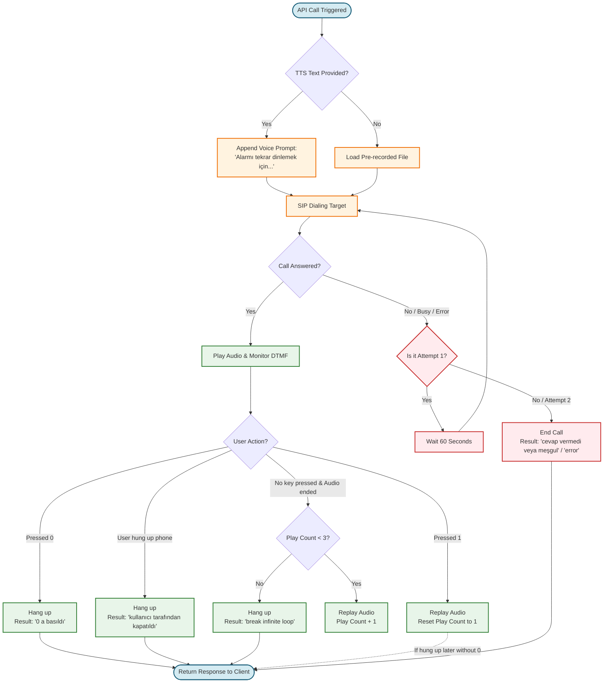
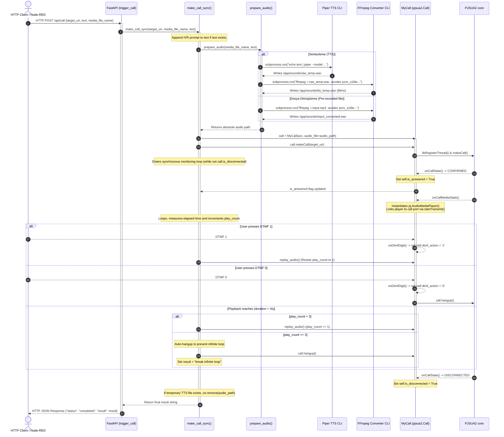

# 📚 PJSUA2 Call Agent: System Flow Documentation

This document describes the architectural, scenario, and technical execution flows of the standalone `pjsua2-call-agent` container. It serves as a reference for integrating the agent into larger automation setups (e.g., Node-RED, monitoring dashboards, or notification scripts).

---

## 🎭 1. Scenario Flow (Senaryo Akışı)

The scenario flow represents the end-user or business logic experience from the initiation of the API call to the phone call outcomes, interactive DTMF keypresses, looping safety limits, and automatic retry attempts.

### 📊 Scenario Flow Diagram



### 📝 Scenario Flow Details

> [!NOTE]
> **Dynamic Prompt Appending:**
> When the API is triggered with `"text"`, the system automatically appends the Turkish IVR prompt: *" Alarmı tekrar dinlemek için 1'e, çağrıyı sonlandırmak için 0'a basın."*

#### Call Connection & Retry Policy
*   **Attempt 1 (Original Call)**: The agent dials the target SIP URI.
*   **Successful Connect**: If the recipient answers the call, the agent moves to the **Interactive IVR State** (re-routing is disabled once connected).
*   **Failed Connect / Busy / Network Error**: If the recipient is busy, doesn't answer within 45 seconds, or a network failure occurs:
    1.  The agent waits for **60 seconds**.
    2.  The agent triggers **Attempt 2 (Retry)**.
    3.  If the retry also fails, it returns the failure status (`"cevap vermedi veya meşgul"` or `"error"`) to the client.

#### Interactive DTMF & Playback Loops
1.  **Replay Trigger (`DTMF 1`)**: Replays the message from the beginning. It resets the play count to `1` so the user can keep listening to the alarm message as needed.
2.  **Hang up Trigger (`DTMF 0`)**: Hangs up the call immediately and returns the status `"0 a basıldı"`.
3.  **Default Replay (No input)**: If the recording finishes playing and the user doesn't press anything within 4 seconds, the message **automatically replays**.
4.  **Loop Safety Limit**: To prevent calling costs and infinite loop channels if the recipient leaves the phone open without interaction, the message will repeat **maximum 3 times**. After the 3rd playback finishes, the agent terminates the call and returns `"break infinite loop"`.
5.  **Direct Disconnection**: If the recipient hangs up their phone during the call (without pressing 0), it returns `"kullanıcı tarafından kapatıldı"`.

---

## 🛠️ 2. Technical Flow (Teknik Akış)

The technical flow describes how FastAPI handles the HTTP request, invokes CLI engines (Piper & FFmpeg) using background subprocesses, passes variables to the PJSIP wrapper, and monitors callbacks to compile the synchronous response.

### 📊 Technical Sequence Diagram



### 📝 Step-by-Step Technical Execution

1.  **FastAPI Endpoint Route (`POST /api/call`)**:
    *   Receives payload data modeled by `CallRequest` (Pydantic model):
        ```python
        class CallRequest(BaseModel):
            target_uri: str
            caller_id: str = "CallAgent"
            media_file_name: str = None
            text: str = None
        ```
    *   Directly calls `make_call_sync(request.target_uri, request.media_file_name, request.text)` synchronously.

2.  **Background Thread Registration**:
    *   Since FastAPI routes run on an asgi event loop, PJSIP requires manual thread registration to execute SIP commands safely. `ep.libRegisterThread("call_thread")` is called immediately.

3.  **Audio File Generation / Conversion (`prepare_audio`)**:
    *   **Metin (TTS) Akışı**:
        *   Piper TTS CLI is run in a shell subprocess:
            `echo "text" | piper --model /app/models/tr_TR-fahrettin-medium.onnx --output_file raw.wav`
        *   FFmpeg translates the high-quality raw output to compliant telephone standard format:
            `ffmpeg -y -i raw.wav -acodec pcm_s16le -ac 1 -ar 8000 tts_temp.wav`
        *   Raw temp file is deleted via `os.remove()`.
    *   **Medya Akışı**:
        *   If the user supplies an audio file (`media_file_name`), the agent locates it in `/app/sounds/`.
        *   FFmpeg standardizes the file format:
            `ffmpeg -y -i input.mp3 -acodec pcm_s16le -ac 1 -ar 8000 input_converted.wav`
    *   Returns the absolute path of the compliant `.wav` file.

4.  **PJSUA2 Object Allocation & Handshake**:
    *   Creates a `MyCall(acc, audio_file=audio_path)` instance.
    *   Initializes SIP dialing via `call.makeCall(target_uri, call_prm)`.

5.  **Monitoring Loop Execution**:
    *   Main thread runs:
        ```python
        while not call.is_disconnected:
            time.sleep(0.1)
        ```
    *   If answered, the loop reads the WAV duration using the Python `wave` module:
        ```python
        def get_wav_duration(file_path):
            with wave.open(file_path, 'r') as f:
                return f.getnframes() / float(f.getframerate())
        ```
    *   A playback timer `play_start = time.time()` tracks the elapsed duration.

6.  **PJSIP Callback Event Execution**:
    *   **`onCallState`**: Listens for state transitions. Sets `self.is_answered = True` when the state matches `PJSIP_INV_STATE_CONFIRMED`.
    *   **`onCallMediaState`**: Triggered when the media port becomes active. Casts the audio media port and maps it to `pj.AudioMediaPlayer()` transmitting the sound.
    *   **`onDtmfDigit`**: Listens to digits (RFC 2833 or SIP INFO). If `0` is received, immediately invokes `self.hangup()`. If `1` is received, flags `self.dtmf_action = '1'` and `self.pressed_1 = True`.

7.  **Loop Disconnection & Return**:
    *   When `call.is_disconnected` becomes true, the loop exits.
    *   Outcome is mapped based on DTMF states:
        ```python
        if call.dtmf_action == '0':
            result = "0 a basıldı"
        elif call.dtmf_action == 'break infinite loop':
            result = "break infinite loop"
        elif call.pressed_1:
            result = "1 e basıldı"
        elif answered:
            result = "kullanıcı tarafından kapatıldı"
        else:
            result = "cevap vermedi veya meşgul"
        ```
    *   If a temporary TTS file was generated, it is deleted from `/app/sounds/` to prevent disk bloat.
    *   The result is returned to the FastAPI endpoint, which responds to the client.
